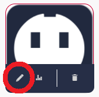
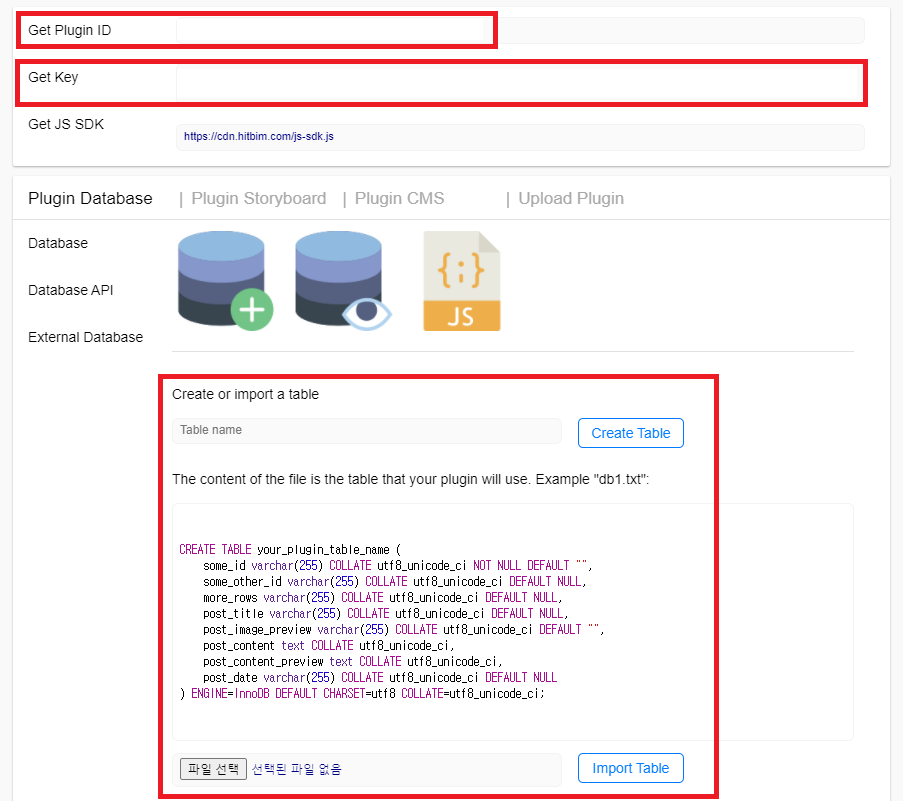
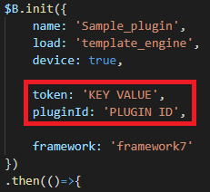

# HITBIM Plugin sample

## 소개
이 문서는 HITBIM DB에 원하는 테이블을 생성하고, 플러그인에서 활용할 수 있게 하는 것을 목표로 합니다.

## HITBIM DB 서버에 테이블 생성하기
1. [Hitbim](https://hitbim.com/)에 로그인합니다.  

2. 좌하단의 '<>' 버튼을 클릭하여 플러그인 대시보드로 이동합니다.  
  

3. +버튼을 클릭하여 새 플러그인을 생성합니다.  

4. 새 플러그인이 생성되면 플러그인 상세정보 페이지로 이동합니다.  
  

5. 테이블 이름을 설정한 후, SQL파일을 업로드하여 DB 테이블을 생성합니다.  
    
Plugin ID, Key값을 가져옵니다.

## 생성된 테이블을 플러그인과 연동하기
1. 플러그인 내 메인JS 파일의 $B.init 함수의 token, pluginId 값을 위에서 가져온 Plugin ID, Key값으로 변경합니다.  
  

2. DB와의 연동이 끝났습니다!  

## 쿼리를 전송하고 데이터 사용하기
Hitbim DB는 다음과 같은 방식으로 동작합니다.

1. 사용할 쿼리를 정의합니다.  
pluginId값은 위에서 가져온 Plugin ID값을, table값은 위에서 생성한 테이블 이름을 사용하여야 합니다.

```
var param = {
    query:[
     {
      query:  'SELECT', // SELECT, INSERT, DELETE etc
      table: 'Table_name', // Table name
      where:{ // Where A and B
        condition1 : uid,
        condition2 : 'cond2'
      }
     }
    ],
    env: 'dev',
    pluginId:"plugin-Example_pluginid" // Plugin ID from website
};
```

2. bim.db.query 함수를 통해 쿼리를 전송하고, 응답을 받습니다.

```
bim.db.query(params, function (res) { // get DB response by callback
    console.log(res[0].data)
});
```

## 쿼리 예시
email, pass, username, active : Column name

1. SELECT
```
var params = {
    query:[
        {
        query:  'SELECT',
        table: 'table_name',
        where: {
            email: email_val,
            pass: password_val,
            username: username_val
            },
        }
    ],
    env: 'dev',
    pluginId: pluginId:"plugin-Example_pluginid"
};
```
2. INSERT  
```
var params = {
    query:[
       {
        query:  'INSERT',
        table: 'table_name',
        rows:{
           email: email_val,
           pass: password_val,
           username: username_val,
           active: 1
           }
        }
    ],
    env: 'dev',
    pluginId:"plugin-Example_pluginid"
};
```
3. UPDATE  
```
var params = {
    query: [{
        query: "UPDATE",
        table: "table_name",
        rows: {
            email: email_val,
        },
        where: {
            username: username_val,
            active: 1
            },
    }],
    env: "dev",
    pluginId:"plugin-Example_pluginid"
}
```
4. DELETE
```
var params = {
    query:[
        {
            query:  'DELETE',
            table: 'table_name',
            where:{
                user_id: userid_val,
                active: 1
            }
        }
    ],
    env: 'dev',
    pluginId: "plugin-Example_pluginid"
};
```
그 외 쿼리들의 예시는 이 리포지토리에 동봉된 DB_params.js 파일을 참조하시기 바랍니다.
